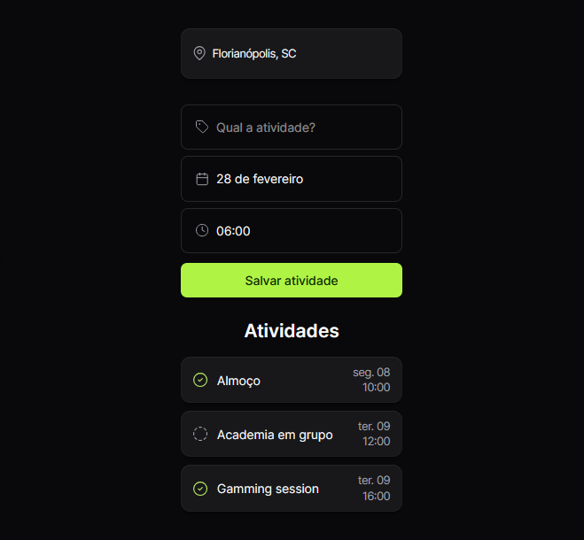
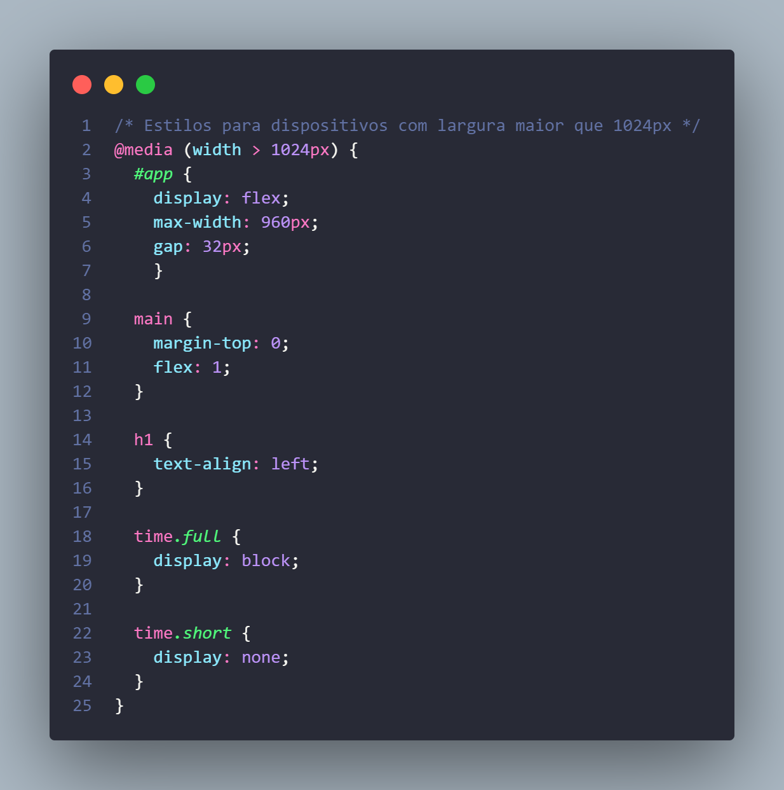
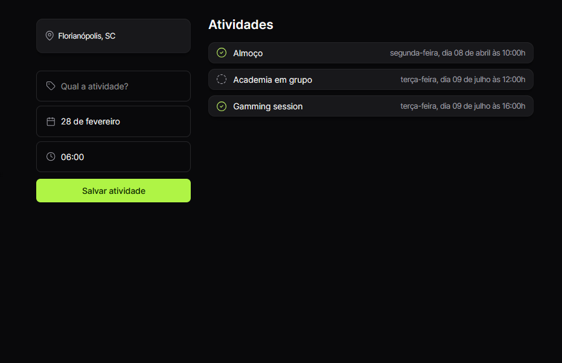

# Roteiro de Viagem 🚀
Projeto realizado durante o evento NLW 16 na trila HTML + CSS + JS.

Para a criação do conteúdo foram utilizados o editor online [fronteditor.dev](https://www.fronteditor.dev/), um layout do [Figma](https://www.figma.com/community/file/1392277205162897872/nlw-journey-roteiro-de-viagem), HTML, CSS e JavaScript.

## Resultado
### MOBILE:

##

### DESKTOP
#### Estilo para adaptar o código para dispositivos com largura maior que 1024px:

#### Resultado:

